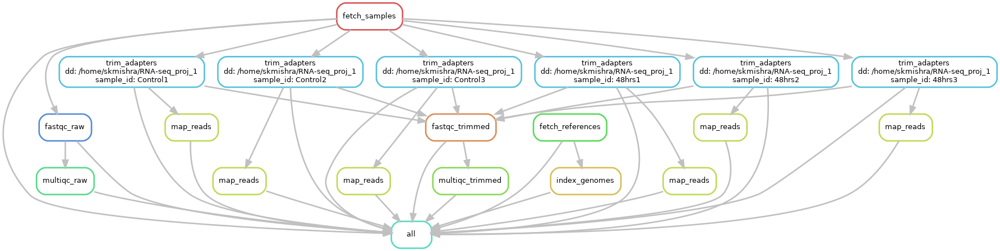

# Snakemake Workflow to Analyze RNA-seq data from Covid-19-infected Samples
The repository contains a Snakemake workflow to analyze data from SARS-CoV-2 infected samples from humans. The workflow analyzes bulk RNA-seq data from a study by Katsura *et al.* (https://www.cell.com/cell-stem-cell/pdf/S1934-5909(20)30499-9.pdf). Katsura *et al.* collected bulk RNA-seq from a sample of SARS-CoV-2 infected human lung cells (alveolar type 2 or AT2 cells) 48 hours post inoculation alongwith RNA-seq from a control (uninfected) sample. Each sample had 3 replicates. The data was deposited by the authors at the gene expression omnibus (GEO) database (GSE152586) and can be accessed at https://www.ncbi.nlm.nih.gov/geo/query/acc.cgi?acc=GSE152586.   

*Note: The current version of the pipeline has only the Data Download, Raw Data Quality Check, Adapter Trimming and Trimmed Data Quality Check sections complete. Work is still in progress for other sections (mapping, quantification and differential gene expression) of the pipeline*

<!-- TABLE OF CONTENTS -->
<details open="open">
  <summary><h2 style="display: inline-block">Table of Contents</h2></summary>
  <ol>
    <li>
      <a href="#about-the-project">About The Project</a>
      <ul>
        <li><a href="#built-with">Built With</a></li>
      </ul>
    </li>
    <li>
      <a href="#getting-started">Getting Started</a>
      <ul>
        <li><a href="#prerequisites">Prerequisites</a></li>
        <li><a href="#installation">Installation</a></li>
      </ul>
    </li>
    <li><a href="#usage">Usage</a></li>
    <li><a href="#license">License</a></li>
    <li><a href="#contact">Contact</a></li>
    <li><a href="#acknowledgements">Acknowledgements</a></li>
  </ol>
</details>


<!-- ABOUT THE PROJECT -->
## About The Project
In this project, I have implemented a Snakemake workflow to analyze bulk RNA-seq data from SARS CoV-2 infected samples. The intent is have the pipeline automated end-to-end to allow the user to run the analysis without any interruptions. This workflow outlines a very basic approach to analyze RNA-seq data and can be modified by any user to add more rules and convert into a more sophisticated workflow. On an added note, I have not included steps for filtering the data for ribosomal RNAs. I assume that mapping the reads to human reference genome and then collecting the data only for mapped reads and assembling the reads into transcripts should result in high confidence mRNA expression data.

For this work, I have used the human and SARS Cov-2 reference genomes available at NCBI.
- Human : https://ftp.ncbi.nlm.nih.gov/genomes/all/GCF/000/001/405/GCF_000001405.39_GRCh38.p13/GCF_000001405.39_GRCh38.p13_genomic.fna.gz
- SAR-CoV-2: https://ftp.ncbi.nlm.nih.gov/genomes/all/GCF/009/858/895/GCF_009858895.2_ASM985889v3/GCF_009858895.2_ASM985889v3_genomic.fna.gz


### Built With
* Python and Snakemake


<!-- GETTING STARTED -->
## Getting Started
You will need a Linux machine (Ubuntu 18.04 or similar) to run this workflow. I have run my analysis on a Ubuntu 18.04 instance using the Amazon Web Services (AWS) Elastic Cloud Compute (EC2) services (https://aws.amazon.com/ec2/?ec2-whats-new.sort-by=item.additionalFields.postDateTime&ec2-whats-new.sort-order=desc). If you already have a good configuration Linux machine (e.g., 12 cores, 32 GB memory, ~1 TB diskspace), you should be good to go. Otherwise, if you have a similar configuration Windows machine and have Windows 10 installed, then you can install windows subsystem linux (WSL) to run the analysis (https://docs.microsoft.com/en-us/learn/modules/get-started-with-windows-subsystem-for-linux/).


### Prerequisites

Ubuntu 18.04 or similar machine with at least 30 GB memory and 1 TB diskspace. Must have BASH installed.

### Installation

**Install from scratch**

1. Clone the repo
   ```
   git clone  https://github.com/sambitmishra0628/RNA-Seq-1
   ```
2. Install miniconda
   ```
   wget https://repo.anaconda.com/miniconda/Miniconda3-latest-Linux-x86_64.sh
   chmod +x Miniconda3-latest-Linux-x86_64.sh
   ./Miniconda3-latest-Linux-x86_64.sh
   ```
   Follow the instructions to complete the installation of miniconda. 

3. Create a conda environment
    ```
    conda create -n rna_seq_env python=3.9
    conda activate rna_seq_env
    ```
   
4. Install mamba
    ```
    conda install -c conda-forge mamba
    ```

5. Install snakemake
    ```
    mamba install -c conda-forge -c bioconda snakemake
    ```

**Install using environment file**

You can use the environment file provided in this repository to create a similar environment as in the above steps. Follow *steps 1 and 2* and then use the following command.
    
`conda create -n rna_seq_env -f env.yml`

<!-- USAGE EXAMPLES -->
## Usage

1. Activate the conda environment (if not already activated)
    ```
    conda activate rna_seq_env
    ```
2. Clone the repository
    ```
    git clone https://github.com/sambitmishra0628/RNA-Seq-1
    ```
3. Change the DATADIR in the `RNA-Seq-1/config.yml` to point to a location in your machine

4. Do a dry run of Snakemake
    ```
    snakemake -n -p --use-conda --configfile config.yml --cores 4
    ```
    *Note that I have set the number of cores to 4. You can increase that number depending on the number of cores available in your machine* ***minus 1***

5. Run the workflow     
    ```
    snakemake -p --use-conda --configfile config.yml --cores 4
    ```

6. Run the following command to view the dag
    ```
    snakemake --dag | dot -Tpng > dag.png
    ```
    


<!-- LICENSE -->
## License

Distributed under the MIT License. See `LICENSE` for more information.


<!-- CONTACT -->
## Contact

Sambit Mishra - sambitmishra0628@gmail.com

Project Link: [https://github.com/sambitmishra0628/RNA-Seq-1](https://github.com/sambitmishra0628/RNA-Seq-1)


<!-- ACKNOWLEDGEMENTS -->
## Acknowledgements

* []()
* []()
* []()


